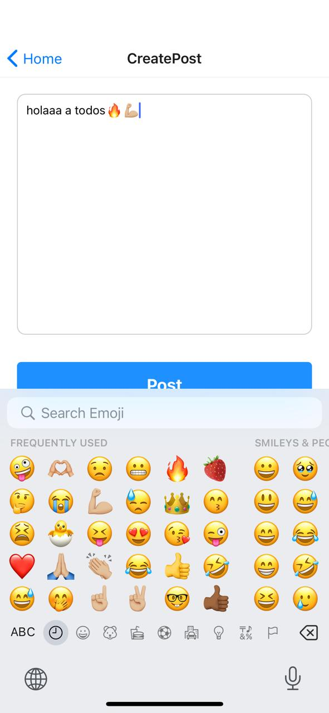

# Social Network App

## Descripción

Esta es una aplicación de red social construida con React Native. Permite a los usuarios registrarse, iniciar sesión y publicar contenido.

## Requisitos Previos

Asegúrate de tener instaladas las siguientes herramientas en tu máquina:

- [Node.js](https://nodejs.org/) (versión 14 o superior)
- [Expo CLI](https://docs.expo.dev/get-started/installation/) (instalado globalmente)
- Un emulador de Android/iOS o un dispositivo físico para ejecutar la aplicación.

## Clonación del Repositorio

1. Abre una terminal.
2. Navega a la carpeta donde deseas clonar el repositorio.
3. Ejecuta el siguiente comando para clonar el repositorio:

   ```bash
   git clone https://github.com/marianaagrcg/Social-Network.git
4.  Accede a la carpeta del proyecto

## Instalacion de Dependencias 
```bash
npm install

npm install -g expo-cli

npx expo start
```

## Social Network App View
 ### Sign Up
   <p align="center">
   
   </p>

   ### Log In
   <p align="center">
      
   </p>

   ### All post view
   <p align="center">
      
   </p>

   ### Following post view
   <p align="center">
      
   </p>

   ### Create post view
   <p align="center">
      
      
   </p>

   ### Edit post view
   <p align="center">
      
      
   </p>